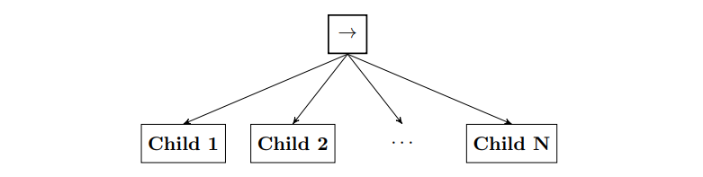

# LightBT: A Lightweight Implementation of Behaviour Tree for Common Tasks

## About Behaviour Trees
Behaviour Tree is a directed rooted tree where the internal nodes are
called **control flow nodes** and leaf nodes are called **execution nodes**. 

For each connected node we use the common terminology of parent and child. The root is the node without parents; all other nodes have one parent. The control flow nodes have
at least one child. Graphically, the children of a node are placed below it, as shown
in Figures 1.

A Behaviour Tree starts its execution from the root node that generates signals that allow
the execution of a node called ticks with a given frequency, which are sent to its
children. 

**A node is executed if and only if it receives ticks.** The child immediately
returns Running to the parent, if its execution is under way, Success if it has achieved
its goal, or Failure otherwise.

In the classical formulation, there exist four categories of control flow nodes
(Sequence, Fallback, Parallel, and Decorator) and two categories of execution nodes
(Action and Condition).
    