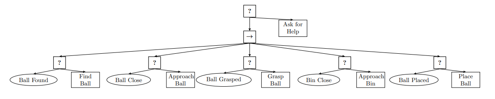
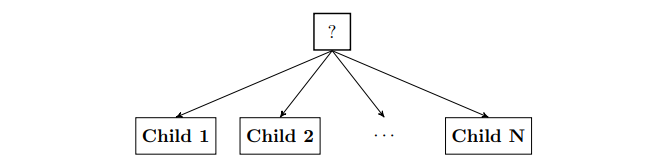
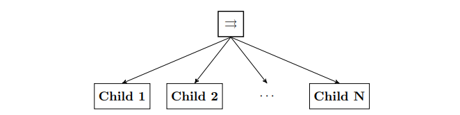
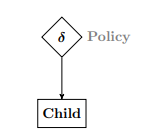
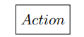
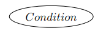
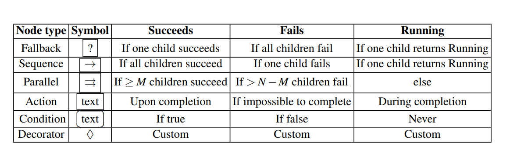

# LightBT: A Lightweight Implementation of Behaviour Tree for Common Tasks

## Behaviour Tree
Behaviour Tree is a directed rooted tree where the internal nodes are
called **control flow nodes** and leaf nodes are called **execution nodes**. 

For each connected node we use the common terminology of parent and child. The root is the node without parents; all other nodes have one parent. The control flow nodes have
at least one child. Graphically, the children of a node are placed below it, as shown
in Figure 1.



A Behaviour Tree starts its execution from the root node that generates signals that allow
the execution of a node called ticks with a given frequency, which are sent to its
children. 

**A node is executed if and only if it receives ticks.** The child immediately
returns Running to the parent, if its execution is under way, Success if it has achieved
its goal, or Failure otherwise.


In the classical formulation, there exist four categories of control flow nodes
(Sequence, Fallback, Parallel, and Decorator) and two categories of execution nodes
(Action and Condition).

## Types of Nodes:
### 1. Sequence Node

### 2. Fallback Node

### 3. Parallel Node


### 4. Decorator Node


### 5. Action Node


### 6. Condition Node


## Node Status of Behaviour Tree
In Figure 8, we can see the node status established by each of the nodes mentioned above while developing the Behaviour Tree.


## Behaviour Tree Traversal

Depth First Traversal is an essential for Behaviour Tree.
The Tick goes from the root node of the tree to its child nodes. As we know that 
BT has items of higher priority in left and lower priority in right, DFS becomes
a suitable traversal algorithm.
Here, we consider that ever node has a parent node and vector of child nodes.
We go down the depth of each node while keeping the node above running. 
Depending on the status received from child node, the parent nodes' status would be 
established.

## Citation
This repository is an implementaion of the journal:
```
@article{DBLP:journals/corr/abs-1709-00084,
  author    = {Michele Colledanchise and
               Petter {\"{O}}gren},
  title     = {Behavior Trees in Robotics and {AI:} An Introduction},
  journal   = {CoRR},
  volume    = {abs/1709.00084},
  year      = {2017},
  url       = {http://arxiv.org/abs/1709.00084},
  eprinttype = {arXiv},
  eprint    = {1709.00084},
  timestamp = {Mon, 13 Aug 2018 16:47:59 +0200},
  biburl    = {https://dblp.org/rec/journals/corr/abs-1709-00084.bib},
  bibsource = {dblp computer science bibliography, https://dblp.org}
}
```